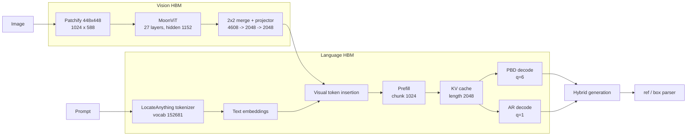

<div align="center">


# LocateAnything on D-Robotics S600

Compiler and runtime adaptation of LocateAnything-3B for the D-Robotics S600 BPU.

[](LICENSE)
[](https://developer.d-robotics.cc/)
[](oellm/README.md)
[](https://huggingface.co/nvidia/LocateAnything-3B)
[](docs/SOURCE_REVIEW.md)

**English** | [中文](README.zh-CN.md)

</div>

## Overview

LocateAnything-3B combines a MoonViT vision encoder, a Qwen2.5 language
decoder, and Parallel Block Decoding (PBD) for visual grounding. This project
implements the model-specific compiler adapters, quantization transforms,
reproducible HBM build workflow, and S600 host runtime components required to
run that architecture on D-Robotics hardware.

Qwen2.5-VL-3B is used as the reference path for validating the OELLM/HBDK
compiler and HBRT runtime chain. The resulting findings on static-image patch
embedding, hidden-domain alignment, Language compilation, and board-side
verification are then applied to the LocateAnything deployment.

## Highlights

- **Architecture-aware port**: MoonViT, 1D RoPE, the 152,681-token vocabulary,
  coordinate tokens, and six-token PBD semantics are represented explicitly.
- **Complete graph contract**: Vision, prefill, PBD decode (`q=6`), and AR
  decode (`q=1`) are exported as independently verifiable BPU graphs.
- **Quantization-domain alignment**: a reproducible signed Walsh-Hadamard
  transform is folded into embeddings, Attention/MLP projections, lm_head,
  and the MoonViT projector without adding runtime matrix multiplications.
- **Reproducible builds**: BC preflight, detached HBM compilation, artifact
  isolation, checksums, and controlled S600 validation are part of the normal
  workflow.
- **Auditable engineering**: source review, compiler changes, numerical
  evidence, known issues, and experiment snapshots are versioned with code.

## Architecture



## Quick Start

### 1. Clone the project and model source

```bash
git clone https://github.com/LiuAnclouds/oe_locateanything.git
cd oe_locateanything
git clone https://github.com/NVlabs/Eagle.git eagle

hf download nvidia/LocateAnything-3B \
  --local-dir eagle/Embodied/LocateAnything-3B
```

### 2. Install the compiler adapter

Install the D-Robotics S600 OELLM 1.0.5 SDK first, then install the vendored
toolchain in the SDK environment:

```bash
source ~/miniforge3/etc/profile.d/conda.sh
conda activate oellm_clean

cd toolchain
pip install -e . --no-deps
cd ..
```

### 3. Run the numerical preflight

```bash
PYTHONPATH=$PWD/toolchain \
python main/scripts/validate_locateanything_rotation.py \
  --model-path eagle/Embodied/LocateAnything-3B \
  --component all \
  --device cuda:0 \
  --dtype float32
```

### 4. Export BC graphs before the long build

```bash
export REPO_ROOT=$PWD
export CONDA_ENV=oellm_clean

EXPORT_ONLY=1 ./main/scripts/compile_locateanything_language.sh
tail -f main/logs/locateanything_language_compile.log

EXPORT_ONLY=1 ./main/scripts/compile_locateanything_vit.sh
tail -f main/logs/locateanything_vit_compile.log
```

### 5. Compile the HBM artifacts

Run Language and Vision sequentially to avoid compiler resource contention:

```bash
./main/scripts/compile_locateanything_language.sh
tail -f main/logs/locateanything_language_compile.log

# Start after the Language build has completed.
./main/scripts/compile_locateanything_vit.sh
tail -f main/logs/locateanything_vit_compile.log
```

The complete environment setup, source changes, mathematical derivation, build
commands, and validation gates are documented in the
[compiler porting guide](docs/COMPILER_PORTING_GUIDE.zh-CN.md).

## Documentation

| Document | Description |
|---|---|
| [Documentation index](docs/README.md) | Entry point for guides, architecture, RCA, and references |
| [Compiler porting guide](docs/COMPILER_PORTING_GUIDE.zh-CN.md) | From Qwen2.5-VL chain validation to LocateAnything HBM compilation |
| [Source review](docs/SOURCE_REVIEW.md) | Checkpoint contract, MoonViT, Qwen decoder, and PBD semantics |
| [Runtime architecture](docs/RUNTIME_ARCHITECTURE.md) | Host/BPU split and runtime module design |
| [Known issues](docs/KNOWN_ISSUES.md) | Reproducible failures, evidence, fixes, and prevention |
| [Qwen2.5-VL baseline](baselines/qwen2_5_vl/README.md) | Compiler-chain validation artifacts and scripts |

## Repository Layout

```text
oe_locateanything/
├── baselines/qwen2_5_vl/       Qwen2.5-VL compiler-chain validation
├── docs/                       guides, architecture, RCA, and issue records
├── main/                       build scripts, runtime, configs, and examples
├── toolchain/leap_llm/         OELLM source and LocateAnything adapters
├── eagle/                      NVIDIA Eagle source and model weights
└── oellm/                      D-Robotics SDK placement
```

Generated weights, BC/HBO/HBM files, logs, and runtime build directories are
kept outside Git history.

## Citation

```bibtex
@misc{locateanything2025,
  title  = {LocateAnything},
  author = {NVIDIA},
  year   = {2025},
  url    = {https://huggingface.co/nvidia/LocateAnything-3B}
}

@misc{oe_locateanything2026,
  title  = {oe_locateanything: LocateAnything-3B Deployment on D-Robotics S600},
  author = {Xu, Kangjie},
  year   = {2026},
  url    = {https://github.com/LiuAnclouds/oe_locateanything}
}
```

## Acknowledgements

- [NVIDIA Eagle](https://github.com/NVlabs/Eagle) and LocateAnything teams
- [Moonshot AI](https://github.com/MoonshotAI) for MoonViT
- [Qwen](https://github.com/QwenLM/Qwen2.5) for the language model family
- [D-Robotics](https://developer.d-robotics.cc/) for the S600 platform and OELLM toolchain
- The D-Robotics developer community for shared deployment experience

## License

This project is licensed under [CC BY-NC 4.0](LICENSE). Model weights, the
D-Robotics SDK, NVIDIA Eagle, and vendored upstream components retain their
respective licenses.
