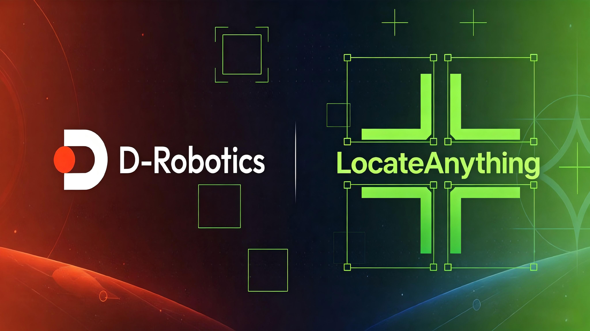

<div align="center">

# ?? oe_locateanything

**LocateAnything-3B deployment workspace for D-Robotics S600**

<p align="center">
  
</p>

[](#)
[](#)
[](#)
[](#)

</div>

## ?? Overview

`oe_locateanything` records the deployment workflow of **LocateAnything-3B** on the **D-Robotics S600** platform.

The project focuses on a modular S600 deployment path for LocateAnything, including:

- ?? **Vision Module**: MoonViT + MLP Projector
- ?? **Language Module**: LocateAnything Qwen2.5 Decoder
- ? **Generation Module**: Slow / Fast(PBD) / Hybrid decoding
- ?? **Runtime Integration**: visual embeddings + text embeddings + KV cache scheduling
- ? **Validation**: PyTorch / HBM output alignment and benchmark records

This repository only tracks deployment code, configuration, notes, and scripts. Model weights, SDK packages, generated HBM files, calibration data, and large artifacts are kept local.

---

## ?? Target Architecture

```text
image
  ?
Vision HBM
  MoonViT + MLP Projector
  input : pixel_values [1656, 3, 14, 14]
  output: visual_embeds [414, 2048]

text prompt
  ?
Host tokenizer
  input_ids

input_ids + visual_embeds
  ?
Host prepares inputs_embeds / position_ids / attention_mask

Qwen Prefill HBM
  input : inputs_embeds [prefill_len, 2048]
          position_ids
          attention_mask
  output: logits
          KV cache

PBD Decode HBM
  input : current block embeddings [6, 2048]
          KV cache
          position_ids
          attention_mask
  output: logits [6, vocab]
          updated KV cache

AR Decode HBM
  input : current token embedding [1, 2048]
          KV cache
          position_ids
          attention_mask
  output: logits [1, vocab]
          updated KV cache

Host
  PBD / Hybrid sampling
  fallback decision
  box / coordinate / token post-processing
```

---

## ?? Repository Layout

```text
oe_locateanything/
  assets/
    LocateAnything.jpg
  main/
    vision/        # MoonViT + MLP Vision Module deployment work
    language/      # Qwen2.5 Prefill / Decode / PBD deployment work
    runtime/       # Host-side runtime integration
    configs/       # Build and runtime configuration files
    scripts/       # Environment, build, validation and benchmark scripts
    golden/        # Golden data placeholders
    benchmarks/    # Benchmark data and records
    outputs/       # Generated artifact placeholders
    logs/          # Build and validation logs
  oellm/
    README.md      # OELLM SDK placement notes
  README.md
```

Local-only directories:

```text
eagle/             # Eagle / LocateAnything source tree
oellm/s600_sdk/    # D-Robotics LLM S600 SDK
oellm/s600_doc/    # D-Robotics LLM S600 documentation
```

These directories are ignored by Git.

---

## ??? Environment Setup

### 1. Clone this repository

```bash
cd ~
git clone https://github.com/LiuAnclouds/oe_locateanything.git
cd oe_locateanything
```

### 2. Clone LocateAnything / Eagle source

```bash
git clone https://github.com/NVlabs/EAGLE.git eagle
```

Expected layout:

```text
oe_locateanything/
  eagle/
    Embodied/
    Eagle/
    Eagle2_5/
```

If using an internal mirror or a prepared archive, place the extracted Eagle repository at:

```text
~/oe_locateanything/eagle
```

### 3. Download D-Robotics LLM S600 SDK

```bash
mkdir -p oellm/s600_sdk
wget https://d-robotics-aitoolchain.oss-cn-beijing.aliyuncs.com/llm_s600/1.0.5/D-Robotics_LLM_S600_1.0.5_SDK.tar.gz
tar -xzf D-Robotics_LLM_S600_1.0.5_SDK.tar.gz -C oellm/s600_sdk
```

Expected SDK path:

```text
oellm/s600_sdk/D-Robotics_LLM_S600_1.0.5_SDK
```

### 4. Download D-Robotics LLM S600 documentation

```bash
mkdir -p oellm/s600_doc
wget https://d-robotics-aitoolchain.oss-cn-beijing.aliyuncs.com/llm_s600/1.0.5/D-Robotics_LLM_S600_1.0.5_Doc.zip
unzip D-Robotics_LLM_S600_1.0.5_Doc.zip -d oellm/s600_doc
```

Expected document path:

```text
oellm/s600_doc/D-Robotics_LLM_S600_1.0.5_Doc
```

### 5. Build the OELLM S600 Docker image

```bash
docker build \
  -t locateanything_oellm_s600:1.0.5 \
  -f main/docker/Dockerfile.oellm_s600 \
  .
```

### 6. Enter the build environment

```bash
main/scripts/run_oellm_s600_docker.sh bash
```

Inside the container, the workspace is mounted at:

```text
/workspace/oe_locateanything
```

---

## ?? Model Summary

| Module | Description |
|---|---|
| Vision Encoder | MoonViT-SO-400M |
| Projector | 2-layer MLP, `4608 ? 2048` |
| Language Model | Qwen2.5-style decoder |
| Vocabulary | `152681` tokens |
| PBD Block | `6` tokens per block |
| Output Format | `<ref>label</ref><box>x1 y1 x2 y2</box>` |

Parameter statistics:

| Module | Params | Share |
|---|---:|---:|
| Qwen2.5 language model | 3.400B | 88.76% |
| MoonViT vision model | 0.417B | 10.88% |
| MLP projector | 0.014B | 0.36% |
| Total | 3.831B | 100% |

---

## ? Current Status

- [x] Define S600 deployment workspace layout
- [x] Prepare OELLM S600 Docker build environment
- [x] Verify `leap_llm-1.0.5` import and CUDA availability
- [ ] Analyze S600 `qwen2_5_vl` / `qwen3_vl` build flow
- [ ] Implement custom MoonViT visual module
- [ ] Implement custom LocateAnything Qwen module
- [ ] Build Prefill / PBD Decode / AR Decode HBM artifacts
- [ ] Integrate Host runtime and validation pipeline

---

## ?? Git Policy

The repository does **not** track:

- model weights
- OELLM SDK packages
- generated HBM / ONNX / GGUF files
- calibration datasets
- `.npy` / `.npz` golden outputs
- large logs and benchmark artifacts

See `.gitignore` for details.

---

## ?? References

- [LocateAnything / Eagle](https://github.com/NVlabs/EAGLE)
- [D-Robotics LLM S600 SDK](https://d-robotics-aitoolchain.oss-cn-beijing.aliyuncs.com/llm_s600/1.0.5/D-Robotics_LLM_S600_1.0.5_SDK.tar.gz)
- [D-Robotics LLM S600 Documentation](https://d-robotics-aitoolchain.oss-cn-beijing.aliyuncs.com/llm_s600/1.0.5/D-Robotics_LLM_S600_1.0.5_Doc.zip)
