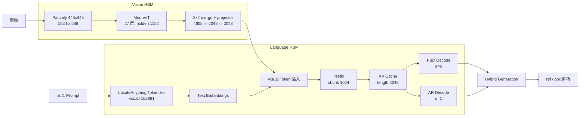

<div align="center">


# LocateAnything-3B on D-Robotics S600

面向 D-Robotics S600 BPU 的架构保真部署方案，覆盖模型编译、量化适配、
HBM 构建、运行时集成与分层验证。

[](LICENSE)
[](https://developer.d-robotics.cc/)
[](oellm/README.md)
[](https://huggingface.co/nvidia/LocateAnything-3B)
[](docs/SOURCE_REVIEW.md)

[English](README.md) | **中文**

</div>

## 项目简介

LocateAnything-3B 面向开放词汇目标定位、区域理解与结构化坐标生成，由 MoonViT
视觉编码器、Qwen2.5 语言解码器和 Parallel Block Decoding（PBD）共同构成。本项目
围绕模型原生接口构建 S600 编译与运行时栈，并提供从 checkpoint、BC/HBM 到板端
执行的可复现工程链路。

为建立可独立验证的编译参考，项目先完成 Qwen2.5-VL-3B 在 OELLM/HBDK 与 HBRT
链路上的端到端验证，再将静态图像 patch embedding、隐藏域对齐、Language 编译
和板端数值验证方法应用于 LocateAnything 的 MoonViT、Qwen decoder 与 PBD 图。

## 项目特性

- **架构保真**：完整保留 MoonViT、1D RoPE、152,681 词表、坐标 token 与
  6-token PBD 语义。
- **分层图合同**：独立导出 Vision、prefill、PBD decode（`q=6`）和 AR decode
  （`q=1`），支持逐阶段检查与验证。
- **零额外算子的隐藏域对齐**：将 signed Walsh-Hadamard 变换离线折叠到
  embedding、Attention/MLP、lm_head 与 MoonViT projector。
- **可复现构建**：提供数值预检、BC 导出、后台 HBM 编译、版本化产物与
  checksum 管理流程。
- **证据驱动验证**：以源码合同、张量接口、数值对齐和 S600 板端结果作为各阶段
  的验收依据。

## 系统架构



## 快速开始

### 1. 获取项目与模型

```bash
git clone https://github.com/LiuAnclouds/oe_locateanything.git
cd oe_locateanything
git clone https://github.com/NVlabs/Eagle.git eagle

hf download nvidia/LocateAnything-3B \
  --local-dir eagle/Embodied/LocateAnything-3B
```

### 2. 安装编译适配

先安装 D-Robotics S600 OELLM 1.0.5 SDK，再在 SDK 环境中安装本项目维护的
`leap_llm`：

```bash
source ~/miniforge3/etc/profile.d/conda.sh
conda activate oellm_clean

cd toolchain
pip install -e . --no-deps
cd ..
```

### 3. 执行数值预检

```bash
PYTHONPATH=$PWD/toolchain \
python main/scripts/validate_locateanything_rotation.py \
  --model-path eagle/Embodied/LocateAnything-3B \
  --component all \
  --device cuda:0 \
  --dtype float32
```

### 4. 先导出 BC 图

```bash
export REPO_ROOT=$PWD
export CONDA_ENV=oellm_clean

EXPORT_ONLY=1 ./main/scripts/compile_locateanything_language.sh
tail -f main/logs/locateanything_language_compile.log

EXPORT_ONLY=1 ./main/scripts/compile_locateanything_vit.sh
tail -f main/logs/locateanything_vit_compile.log
```

### 5. 编译 HBM

建议 Language 完成后再启动 Vision，避免两个 HBDK 作业争抢编译资源：

```bash
./main/scripts/compile_locateanything_language.sh
tail -f main/logs/locateanything_language_compile.log

# Language 完成后执行
./main/scripts/compile_locateanything_vit.sh
tail -f main/logs/locateanything_vit_compile.log
```

环境搭建、源码修改、数学原理、完整命令和验证标准见
[从零编译与适配原理](docs/COMPILER_PORTING_GUIDE.zh-CN.md)。

## 文档

| 文档 | 内容 |
|---|---|
| [文档索引](docs/README.md) | 教程、架构、RCA 和参考资料入口 |
| [从零编译与适配原理](docs/COMPILER_PORTING_GUIDE.zh-CN.md) | 从 Qwen2.5-VL 链路验证到 LocateAnything HBM |
| [上游源码审计](docs/SOURCE_REVIEW.md) | Checkpoint、MoonViT、Qwen decoder 与 PBD 语义 |
| [运行时架构](docs/RUNTIME_ARCHITECTURE.md) | Host/BPU 分层和运行时模块设计 |
| [已知问题](docs/KNOWN_ISSUES.md) | 可复现问题、证据、修复与预防 |
| [Qwen2.5-VL 链路验证](baselines/qwen2_5_vl/README.md) | 基线产物、配置和实验脚本 |

## 项目结构

```text
oe_locateanything/
├── baselines/qwen2_5_vl/       Qwen2.5-VL 编译链路验证
├── docs/                       教程、架构、RCA 与问题记录
├── main/                       编译脚本、运行时、配置和示例
├── toolchain/leap_llm/         OELLM 源码与 LocateAnything 适配
├── eagle/                      NVIDIA Eagle 源码与模型权重
└── oellm/                      D-Robotics SDK 目录
```

模型权重、BC/HBO/HBM、日志和运行时构建产物不进入 Git 历史。

## 致谢

- [NVIDIA Eagle](https://github.com/NVlabs/Eagle) 与 LocateAnything 团队
- [Moonshot AI](https://github.com/MoonshotAI) 的 MoonViT
- [Qwen](https://github.com/QwenLM/Qwen2.5) 模型家族
- [D-Robotics](https://developer.d-robotics.cc/) S600 平台与 OELLM 工具链
- 分享部署经验的 D-Robotics 开发者社区

## 许可证

本项目采用 [CC BY-NC 4.0](LICENSE)。模型权重、D-Robotics SDK、NVIDIA Eagle
及其他上游组件继续遵循各自许可证。
