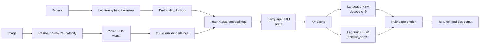

# LocateAnything S600 Runtime Architecture

LocateAnything uses two independently compiled HBM artifacts and a Host-side
runtime. The split follows the model boundary: MoonViT and its projector form
the Vision graph, while the Qwen2.5 decoder and lm_head form the Language
graphs. The Host runtime owns multimodal sequence construction and PBD/Hybrid
generation.

## 1. System Boundary



Keeping Vision and Language as separate artifacts provides independent
compilation, checksums, graph inspection, and numerical comparison. The Host
still transfers visual embeddings between graph invocations, so packaging the
graphs into one file would not remove the model boundary by itself.

## 2. Compiled Graph Contract

The current build profile is fixed to one image at 448x448, Language prefill
chunk 1024, logical cache length 2048, PBD block size 6, and batch size 1.

### Vision `visual`

| Tensor | Shape | Dtype | Meaning |
|---|---|---|---|
| Input | `(1, 1024, 588)` | fp16 | 32x32 flattened RGB patches, each `3x14x14` |
| Output | `(1, 256, 2048)` | fp16 | MoonViT features after 2x2 merge and projector |

The projector output is already in the hidden domain consumed by the Language
embedding stream. No additional runtime projection is required.

### Language `prefill`

| Input | Shape | Dtype |
|---|---|---|
| Embeddings | `(1, 1024, 2048)` | fp16 |
| Position IDs | `(1, 1, 1024)` | int32 |
| Attention mask | `(1, 1024, 2048)` | fp16 |
| 36 key caches | `(1, 2048, 2, 128)` each | fp32 |
| 36 value caches | `(1, 2048, 2, 128)` each | fp32 |

The graph returns logits `(1, 1024, 152681)` and one key/value update per
decoder layer.

### Language `decode`

The PBD graph uses the same tensor order as `prefill`, with query length 6:

- embeddings `(1, 6, 2048)`;
- position IDs `(1, 1, 6)`;
- attention mask `(1, 6, 2048)`;
- logits `(1, 6, 152681)`.

### Language `decode_ar`

The AR fallback graph uses query length 1:

- embeddings `(1, 1, 2048)`;
- position IDs `(1, 1, 1)`;
- attention mask `(1, 1, 2048)`;
- logits `(1, 1, 152681)`.

Generated BC and HBM metadata remain the authoritative source for exact output
strides and quantized cache storage. Record that metadata with each artifact.

## 3. Host Responsibilities

| Stage | Responsibility |
|---|---|
| Image preprocessing | Decode, resize to 448x448, normalize, and patchify to `(1024,588)` |
| Tokenization | Apply the LocateAnything chat template and preserve model special-token IDs |
| Embedding lookup | Gather fp16 rows from the rotated `embed_tokens.bin` table |
| Multimodal merge | Replace the image placeholder with exactly 256 Vision embeddings |
| Position IDs | Build 1D RoPE positions and the PBD six-position offset |
| Attention mask | Build prefill causal masking, PBD block masking, and AR fallback masking |
| KV management | Maintain 36 key/value pairs across prefill, PBD, and AR graph calls |
| Sampling | Execute the upstream-compatible PBD/Hybrid token-selection policy |
| Output parsing | Decode `<ref>`, `<box>`, coordinate, null, and termination tokens |

The common 2048-dimensional signed Hadamard transform is folded into the
compiled weights and exported embedding table. The Host runtime must not apply
another hidden-state rotation.

## 4. PBD and Hybrid Flow

LocateAnything prepares a six-position PBD window containing the current tail
token and five `<text_mask>` tokens. The last six position IDs share the model's
PBD offset, and the attention mask exposes the corresponding block according to
the upstream generation rules.

After each PBD invocation, the Host validates the generated pattern:

1. valid six-token box frames remain on the PBD path;
2. malformed or partial box frames can fall back to `decode_ar`;
3. AR decoding returns to PBD after the configured box boundary;
4. terminal and null patterns stop generation;
5. coordinate logits are decoded with the upstream box-selection policy rather
   than treated as unrestricted text argmax output.

The source contract for this behavior is retained under
`main/runtime/reference/upstream_la/` and summarized in
`main/runtime/docs/INFERENCE_FLOW.md`.

## 5. Runtime Implementation

The C++ runtime under `main/runtime/` currently contains:

- HBM loading, graph discovery, tensor allocation, and execution;
- mmap-based embedding lookup;
- fixed-resolution image preprocessing;
- attention-mask and position-ID builders;
- focused probes for Vision, prefill layout, embeddings, masks, and positions;
- upstream LocateAnything runtime references for the PBD/Hybrid port.

The end-to-end runtime still requires the tokenizer wrapper, multimodal token
merge, persistent KV orchestration, sampling, PBD/AR switching, and structured
box parser to be validated together on S600. Component load success or nonzero
logits are intermediate evidence, not end-to-end model validation.

## 6. Artifact Layout

```text
main/
├── vision/outputs/              generated Vision BC/HBO/HBM
├── language/outputs/            generated Language BC/HBO/HBM and embeddings
├── runtime/                     C++ Host runtime and focused probes
├── configs/                     versioned runtime configuration templates
├── golden/                      generated PyTorch reference tensors
├── logs/                        compiler and board-validation logs
└── benchmarks/                  generated benchmark results
```

Generated artifacts are excluded from Git. Each build should use a versioned
directory and retain the source commit, compiler version, build profile, HBM
checksum, runtime version, and validation inputs.

## 7. Validation Gates

1. Inspect BC graph names, tensor shapes, dtypes, and operation counts.
2. Verify HBM checksums before and after transfer to S600.
3. Load `visual`, `prefill`, `decode`, and `decode_ar` independently.
4. Compare fixed-input HBM outputs with PyTorch reference tensors.
5. Validate text generation before multimodal insertion.
6. Validate one-image grounding and structured box output.
7. Validate PBD-to-AR fallback and return-to-PBD behavior.
8. Publish TPS and BPS only after the end-to-end path and measurement protocol
   are stable.

Board commands, artifact synchronization, and evidence levels are documented
in [S600 runtime and synchronization](tutorials/S600_RUNTIME.md).
